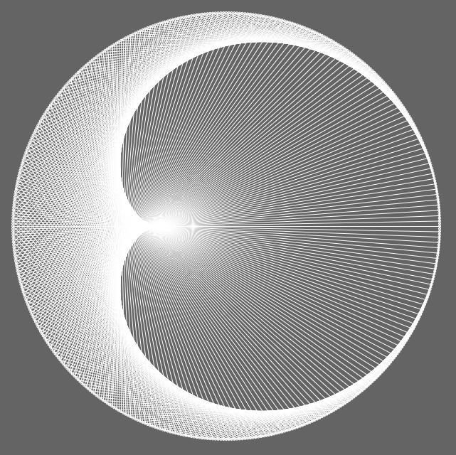

# Times-Tables-Visualization

writen in javascript

with the p5*js library

inspired by [@shiffman](https://github.com/shiffman)

[This video ](https://www.youtube.com/watch?v=qhbuKbxJsk8)explains the mathematics behind this phenomenon.

